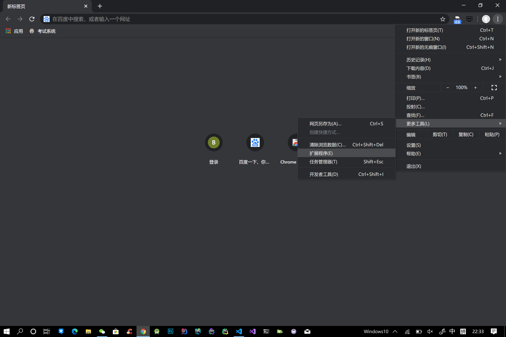
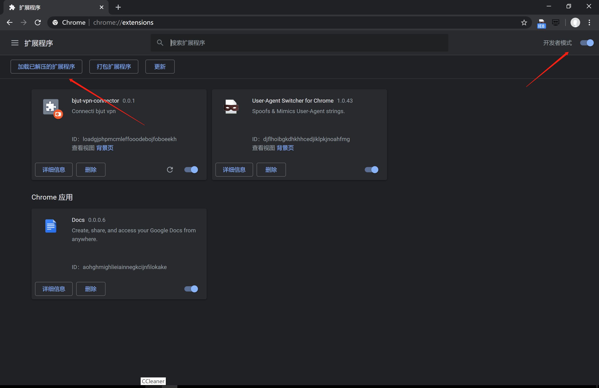
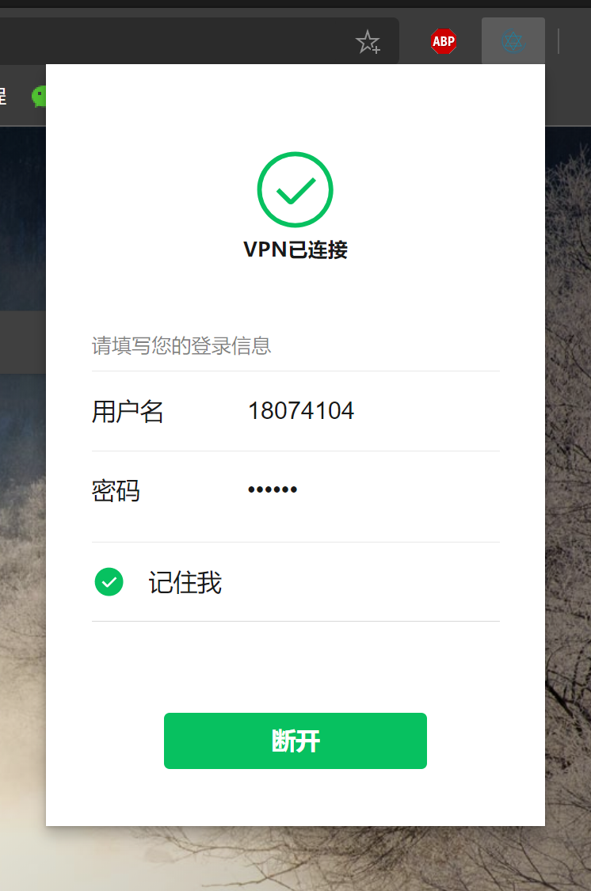
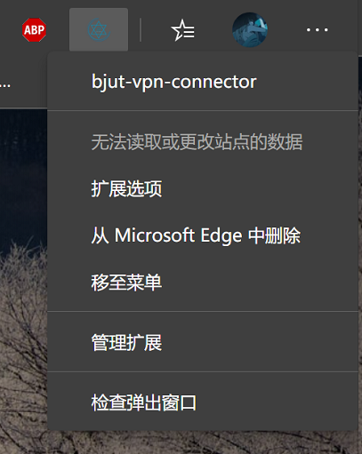
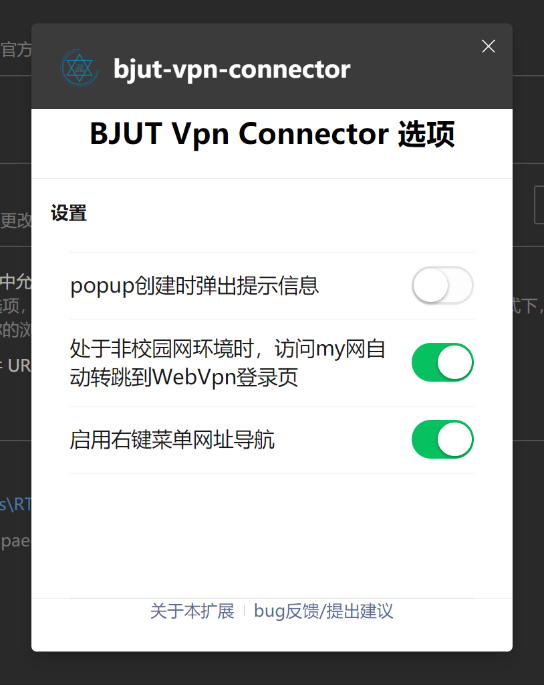

# bjut-vpn-connector
  
 
用于连接北京工业大学vpn的Chrome扩展

## 介绍
### 制作背景
众所周知，2020年，就连Microsoft Edge也换成Chromium内核了，而我校vpn还在使用ie登录。新版Edge不像旧版有一个使用IE打开的选项，IE藏得比较深，再加上当IE调用了Infosec SSL VPN之后，用户的就只能访问学校内网，与外网断开了连接，我用起来不爽。所以我写了这个扩展用于连接BJUT的vpn。

### 原理说明
__先说好，这可不是我做的VPN，我只是用插件整合了学校提供的VPN连接方式__
对于北京工业大学信息门户`my.bjut.edu.cn`以及网上办事`mysvr.bjut.edu.cn`, 学校提供了WebVpn的统一认证方式。对于其他学校网站（已知的有教务网站），需登录`vpn.bjut.edu.cn`,登录以后可以修改url前缀为`https://vpn.bjut.edu.cn/prx/000/http/`来访问内网。
因此，通过chrome提供的webRequest API将url重定向至对应站点，即可实现访问内网的同时，不会断开与外网的连接。

### 第二作者
[blxjojo](https://github.com/blxjojo)
### 资源和框架
+ popup和options界面使用 [WeUI](https://github.com/Tencent/weui)

## 安装扩展

### 安装要求
本扩展可以安装在Google Chrome浏览器以及Chromium内核浏览器，比如新版Edge以及一众国产浏览器。

### 解压安装
1. 到release页面下载zip压缩包，并解压缩。
2. 打开浏览器，找到`扩展程序`选项
   

3. 先启用`开发者模式`，再点击`加载已解压缩的扩展`，选择扩展的根目录即可完成安装
   

### 从扩展商店安装

本扩展已经上架Microsoft Edge Addons，点击查看[隐私政策](http://59.110.236.102/BjutVpnConnector/Privacy)

## 如何使用
点击浏览器地址栏右侧图标（深色主题下可能看不清，鼠标移上去会有提示）

然后在弹出的界面中输入学号和校园网密码，点击连接。插件上显示已连接，则可以使用。

在插件按钮上右击，弹出菜单，选择扩展选项可以打开扩展的设置页面。

你可以在设置页面中启用`非校园网环境访问my网自动转跳到WebVpn登录页`功能。__注意：启动以后无论是否连接vpn，只要是访问信息门户和网上办事都会转跳__。
如果遇到了bug，或者你对本扩展有什么想法和建议，可以点击最下方的`bug反馈/提出建议`来告诉我们。

## 版权许可
MIT
